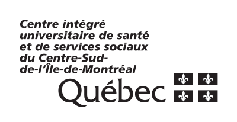

Courtois NeuroMod
=================

.. note:: This documentation corresponds to the cneuromod-2022 alpha release. 

The Courtois project on Neural Modelling (cneuromod) aims at training artificial neural networks using extensive experimental data on individual human brain activity and behaviour. Six subjects (three women, three men) are getting scanned weekly for five years, for a total of 500 hours of functional data per subject, including functional localizers (vision, language, memory, emotion), movies and video game play. Functional neuroimaging data are collected with both functional magnetic resonance imaging, magnetoencephalography and a variety of sensors (including electrodermal activity and occulometry).

The cneuromod project is funded by a donation of the Courtois foundation. Courtois NeuroMod data are freely shared with the scientific community to advance research at the interface of neuroscience and artificial intelligence. Access to to the data is based on a registered access model, requiring a short scientific project description and institutional signature of a data transfer agreement. An overview of the project is available on the cneuromod `website <https://www.cneuromod.ca/>`_ and the technical documentation of the latest release is accessible `here <https://docs.cneuromod.ca/>`_. 

.. image:: img/logo_neuromod_black.png
  :width: 200px

.. image:: img/logo_udem.png
  :width: 200px
